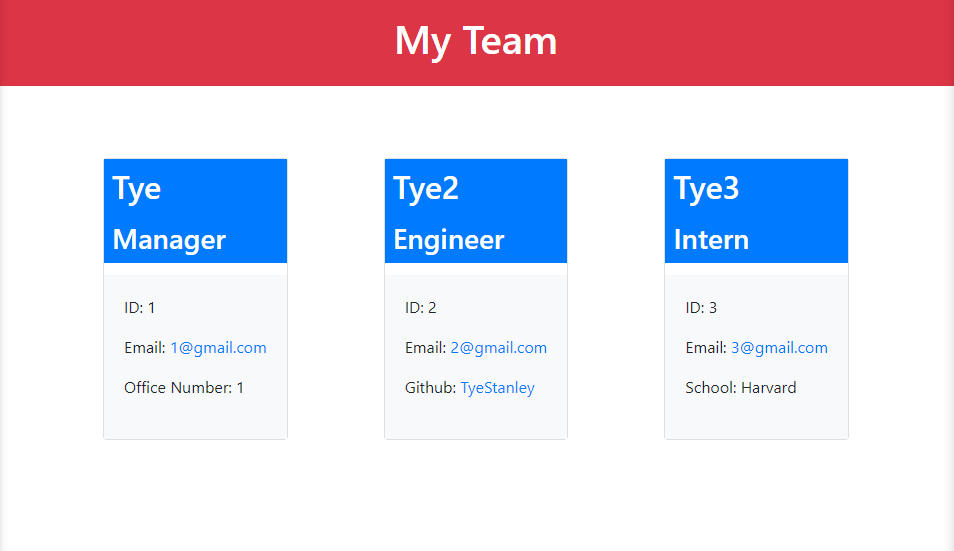

# Team Profile Generator

This is a node.js app that uses the command-line with the help of inquirer to take in information about employees to then generate an HTML webpage that sorts each employee into a card.

## Installation

1. Download/clone my repository
2. This app requires node.js to be used.
3. Do `npm install` to install the required npm dependecies

## Usage

* This app will be ran by using the following command: `npm start`

* User will then be prompted for information to select 1 of 3 types of employee
  * Manager (Limit: 1)
  * Engineer (no limit)
  * Intern (no limit)

* Every employee will be asked the following information with validation
  * Name
  * ID
  * Email

* Each role also has its own special information
  * Manager - Office Number
  * Engineer - GitHub Username
  * Intern - School

* After everything has been selected a index.html file will be generated with user input data located in the `dist` folder

* Sample picture to showcase how it would look like

[Video Demo](https://drive.google.com/file/d/1SE2Y4ZsGXy0GLbLkncT2f4bkuOIiwgGj/view?usp=sharing)

## Features

* JavaScript
* Node.js
* Jest
* NPM
* Bootstrap

## License

Copyright &copy; Tye Stanley. All rights reserved.
  
  Licensed under the [MIT](LICENSE) license.